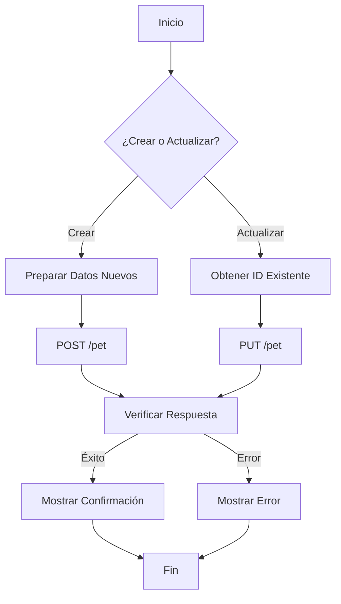

# Tienda de Mascotas - Prueba Técnica

Este proyecto es una aplicación web desarrollada con Next.js que permite gestionar una tienda de mascotas online, utilizando la API de PetStore.

## Tecnologías Utilizadas

- Next.js 15.1.4 (App Router)
- React 19
- TypeScript
- Tailwind CSS
- Axios

## Características

- Listado de mascotas disponibles
- Creación de nuevas mascotas
- Edición de mascotas existentes
- Compra de mascotas
- Interfaz responsiva
- Tema claro/oscuro
- Notificaciones de estado

## Guía Paso a Paso: Gestión de Mascotas

### 1. Crear una Nueva Mascota

Para crear una nueva mascota en el sistema, sigue estos pasos:

1. Hacer una petición POST a `/pet` con el siguiente formato:
```javascript
const newPet = {
  name: "Nombre de la mascota",
  photoUrls: ["url_de_la_foto"],
  status: "available",
  category: {
    id: 1,
    name: "Categoría"
  }
};

await axios.post('https://petstore.swagger.io/v2/pet', newPet);
```

### 2. Actualizar una Mascota Existente

Para actualizar los datos de una mascota:

1. Hacer una petición PUT a `/pet` con los datos actualizados:
```javascript
const updatedPet = {
  id: petId,
  name: "Nuevo nombre",
  status: "available",
  // ... otros campos
};

await axios.put('https://petstore.swagger.io/v2/pet', updatedPet);
```

### 3. Diagrama de Flujo del Proceso



### 4. Ejemplo de Código Completo

```typescript
// Crear una mascota
const createPet = async (petData: Pet) => {
  try {
    const response = await axios.post('https://petstore.swagger.io/v2/pet', {
      name: petData.name,
      photoUrls: petData.photoUrls,
      status: 'available',
      category: petData.category
    });
    return response.data;
  } catch (error) {
    throw new Error('Error al crear la mascota');
  }
};

// Actualizar una mascota
const updatePet = async (petData: Pet) => {
  try {
    const response = await axios.put('https://petstore.swagger.io/v2/pet', petData);
    return response.data;
  } catch (error) {
    throw new Error('Error al actualizar la mascota');
  }
};

// Comprar una mascota
const buyPet = async (petId: number) => {
  try {
    const response = await axios.post('https://petstore.swagger.io/v2/store/order', {
      petId,
      quantity: 1,
      status: 'placed'
    });
    return response.data;
  } catch (error) {
    throw new Error('Error al realizar la compra');
  }
};
```

## Instalación y Ejecución

1. Clonar el repositorio
```bash
git clone <url-del-repositorio>
```

2. Instalar dependencias
```bash
npm install
```

3. Ejecutar en modo desarrollo
```bash
npm run dev
```

4. Construir para producción
```bash
npm run build
```

5. Ejecutar en producción
```bash
npm start
```

## Estructura del Proyecto

```
src/
├── app/                    # Páginas de Next.js
├── components/            # Componentes React reutilizables
│   ├── PetCard.tsx       # Tarjeta de mascota
│   ├── PetForm.tsx       # Formulario de mascota
│   └── Toast.tsx         # Componente de notificaciones
├── services/             # Servicios y APIs
│   └── api.ts           # Cliente API de PetStore
├── types/               # Definiciones de TypeScript
│   └── pet.ts          # Tipos para mascotas y órdenes
└── utils/              # Utilidades y helpers
public/                 # Archivos estáticos
└── placeholder-pet.svg # Imagen placeholder
```

## Mejores Prácticas Implementadas

1. **Arquitectura Limpia**
   - Separación clara de responsabilidades
   - Componentes modulares y reutilizables
   - Servicios centralizados para la lógica de negocio

2. **TypeScript**
   - Tipos estrictos para mejor mantenibilidad
   - Interfaces claras para los datos
   - Mejor experiencia de desarrollo

3. **UI/UX**
   - Diseño responsivo
   - Feedback visual para acciones del usuario
   - Animaciones suaves
   - Soporte para tema claro/oscuro
   - Mensajes de error claros

4. **Rendimiento**
   - Imágenes optimizadas
   - Carga bajo demanda
   - Componentes del lado del cliente cuando es necesario

5. **Accesibilidad**
   - Etiquetas semánticas
   - Textos alternativos para imágenes
   - Contraste adecuado
   - Navegación por teclado

## Contribución

1. Crear un fork del repositorio
2. Crear una rama para tu feature (`git checkout -b feature/AmazingFeature`)
3. Commit de tus cambios (`git commit -m 'Add some AmazingFeature'`)
4. Push a la rama (`git push origin feature/AmazingFeature`)
5. Abrir un Pull Request
