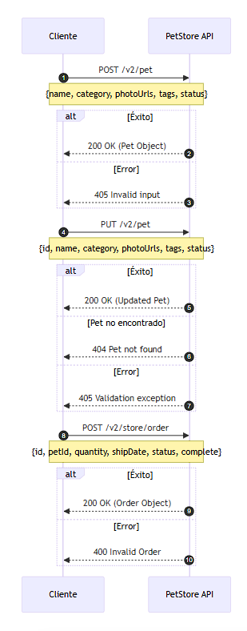
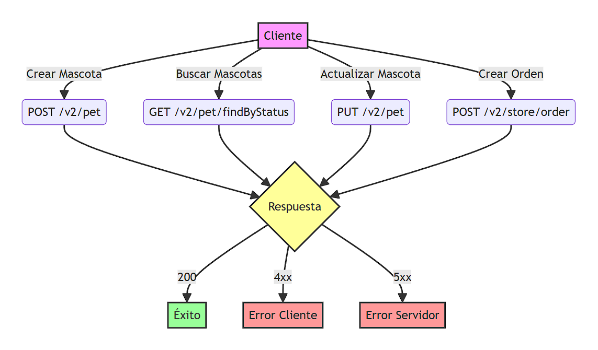

# PetShop - Prueba Técnica

Una aplicación web moderna desarrollada con Next.js para gestionar una tienda de mascotas utilizando la PetStore API. La aplicación permite ver, crear, editar y comprar mascotas, con una interfaz de usuario moderna y una experiencia de usuario fluida.

## 🚀 Tecnologías Utilizadas

- **Next.js 15.1.4** - Framework de React con App Router
- **React 19** - Biblioteca para interfaces de usuario
- **TypeScript** - Superset tipado de JavaScript
- **Tailwind CSS** - Framework de CSS utilitario
- **Zustand** - Gestión de estado
- **Axios** - Cliente HTTP
- **Shadcn/ui** - Componentes de UI reutilizables
- **Lucide Icons** - Iconos modernos

## ✨ Características

- **Gestión de Mascotas**
  - Listado de mascotas con paginación
  - Creación de nuevas mascotas
  - Edición de mascotas existentes
  - Compra de mascotas
  - Filtrado por estado (disponible, pendiente, vendido)

- **Diseño Moderno**
  - Interfaz minimalista y elegante
  - Paleta de colores profesional
  - Gradientes y sombras suaves
  - Animaciones y transiciones fluidas
  - Diseño totalmente responsive

- **Experiencia de Usuario**
  - Notificaciones toast para feedback
  - Validación de formularios
  - Carga progresiva de datos
  - Manejo de errores amigable
  - Ordenamiento inteligente (más recientes primero)

## 🛠️ Estructura del Proyecto

```
src/
├── app/                    # Rutas y páginas
├── components/            # Componentes reutilizables
│   ├── ui/               # Componentes de shadcn/ui
│   ├── PetCard.tsx      # Tarjeta de mascota
│   ├── PetForm.tsx      # Formulario de mascota
│   ├── Toast.tsx        # Componente de notificaciones
│   └── Navbar.tsx       # Barra de navegación
├── hooks/                # Hooks personalizados
├── services/            # Servicios y API
├── store/               # Estado global (Zustand)
├── types/               # Tipos TypeScript
└── lib/                 # Utilidades y configuraciones
```

## 🚦 Guía de Uso

### Instalación

1. Clona el repositorio:
```bash
git clone https://github.com/AndresO7/TechnicalTestKushki
```

2. Instala las dependencias:
```bash
npm install
```

3. Inicia el servidor de desarrollo:
```bash
npm run dev
```

### Gestión de Mascotas

1. **Ver Mascotas**
   - Las mascotas se muestran en una cuadrícula responsive
   - Usa los filtros para ver mascotas por estado
   - Scroll infinito para cargar más mascotas

2. **Crear Mascota**
   - Haz clic en "Nueva Mascota"
   - Completa el formulario con:
     - Nombre de la mascota
     - Categoría
     - URL de la foto
     - Etiquetas (mínimo una)
     - Estado

3. **Editar Mascota**
   - Haz clic en el botón de edición en la tarjeta
   - Modifica los campos necesarios
   - Guarda los cambios

4. **Comprar Mascota**
   - Haz clic en "Comprar" en una mascota disponible
   - Confirma la compra
   - La mascota cambiará a estado "vendido"

## 🌟 Mejores Prácticas Implementadas

- **Arquitectura Limpia**
  - Separación clara de responsabilidades
  - Servicios modulares
  - Gestión de estado centralizada

- **TypeScript**
  - Tipos estrictos para mejor mantenibilidad
  - Interfaces bien definidas
  - Validación de tipos en tiempo de compilación

- **UI/UX**
  - Diseño consistente con shadcn/ui
  - Feedback visual inmediato
  - Manejo de estados de carga
  - Mensajes de error claros

- **Rendimiento**
  - Carga lazy de componentes
  - Optimización de imágenes
  - Paginación eficiente
  - Caché de datos

- **Accesibilidad**
  - Etiquetas semánticas
  - Contraste de colores adecuado
  - Navegación por teclado
  - Textos alternativos


## 📝 Notas Adicionales

- La aplicación utiliza la API pública de PetStore
- Los datos son persistentes en la API
- Las imágenes deben ser URLs públicas accesibles

## 📘 Guía Técnica: Gestión de Mascotas

### Diagramas de Flujo



### Diagrama de Interacción con la API



### Ejemplos de Código

#### 1. Crear una Nueva Mascota

```javascript
// Servicio para crear una mascota
const createPet = async (petData) => {
  try {
    const response = await axios.post('https://petstore.swagger.io/v2/pet', {
      id: Date.now(), // ID único
      name: petData.name,
      category: {
        id: petData.category.id,
        name: petData.category.name
      },
      photoUrls: petData.photoUrls,
      tags: petData.tags.map(tag => ({
        id: tag.id,
        name: tag.name
      })),
      status: 'available'
    });

    return response.data;
  } catch (error) {
    throw new Error('Error al crear la mascota: ' + error.message);
  }
};

// Ejemplo de uso
const newPet = {
  name: "Max",
  category: {
    id: 1,
    name: "Perros"
  },
  photoUrls: ["https://ejemplo.com/foto.jpg"],
  tags: [
    {
      id: 1,
      name: "amigable"
    }
  ]
};

// Crear la mascota
const createdPet = await createPet(newPet);
```

#### 2. Actualizar una Mascota Existente

```javascript
// Servicio para actualizar una mascota
const updatePet = async (petData) => {
  try {
    const response = await axios.put('https://petstore.swagger.io/v2/pet', {
      id: petData.id,
      name: petData.name,
      category: petData.category,
      photoUrls: petData.photoUrls,
      tags: petData.tags,
      status: petData.status
    });

    return response.data;
  } catch (error) {
    throw new Error('Error al actualizar la mascota: ' + error.message);
  }
};

// Ejemplo de uso
const updatedPet = {
  id: 123, // ID de la mascota existente
  name: "Max",
  category: {
    id: 1,
    name: "Perros"
  },
  photoUrls: ["https://ejemplo.com/nueva-foto.jpg"],
  tags: [
    {
      id: 1,
      name: "amigable"
    },
    {
      id: 2,
      name: "entrenado"
    }
  ],
  status: "available"
};

// Actualizar la mascota
const result = await updatePet(updatedPet);
```

#### 3. Comprar una Mascota

```javascript
// Servicio para crear una orden de compra
const purchasePet = async (petId) => {
  try {
    // 1. Crear la orden
    const orderResponse = await axios.post('https://petstore.swagger.io/v2/store/order', {
      id: Date.now(),
      petId: petId,
      quantity: 1,
      shipDate: new Date().toISOString(),
      status: "placed",
      complete: true
    });

    // 2. Actualizar el estado de la mascota
    const petResponse = await axios.put('https://petstore.swagger.io/v2/pet', {
      id: petId,
      status: "sold"
    });

    return {
      order: orderResponse.data,
      pet: petResponse.data
    };
  } catch (error) {
    throw new Error('Error en el proceso de compra: ' + error.message);
  }
};

// Ejemplo de uso
const result = await purchasePet(123);
```

### Endpoints de la API

| Método | Endpoint | Descripción |
|--------|----------|-------------|
| POST | `/pet` | Crear una nueva mascota |
| PUT | `/pet` | Actualizar una mascota existente |
| GET | `/pet/findByStatus` | Obtener mascotas por estado |
| POST | `/store/order` | Crear una orden de compra |

### Códigos de Estado

| Código | Descripción |
|--------|-------------|
| 200 | Operación exitosa |
| 400 | Petición inválida |
| 404 | Mascota no encontrada |
| 500 | Error del servidor |
